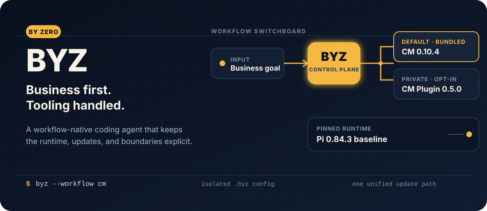
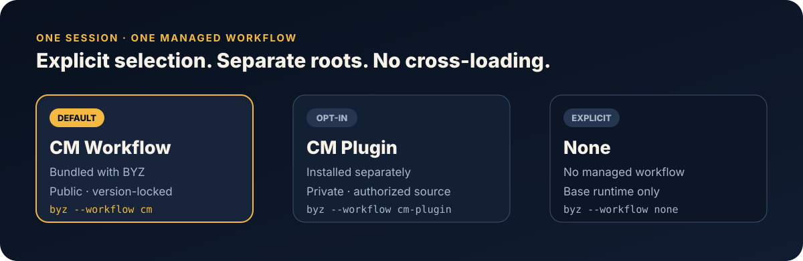
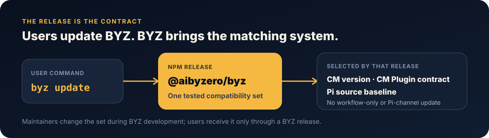

<p align="center">
  
</p>

<p align="center">
  <a href="./README.md">English</a> · <strong>简体中文</strong>
</p>

<p align="center">
  <a href="https://www.npmjs.com/package/@aibyzero/byz"></a>
  <a href="./packages/byz/package.json"></a>
  <a href="./LICENSE"></a>
</p>

<p align="center">
  <strong>BYZ 是 Zero 打造的业务优先编程智能体：统一命令、工作流隔离，以及可追溯的 Pi 基座。</strong>
</p>

<p align="center">
  <a href="#快速开始">快速开始</a> ·
  <a href="#工作流隔离">工作流</a> ·
  <a href="#统一更新入口">更新</a> ·
  <a href="#基于-pi-构建">基于 Pi 构建</a> ·
  <a href="./packages/byz/README.md">完整参考</a>
</p>

## 快速开始

安装公开 npm 包并启动 BYZ：

```bash
npm install -g --ignore-scripts @aibyzero/byz
byz --version
byz workflow check cm
byz
```

BYZ 将用户配置保存在 `.byz`，而不是 `.pi`。CM 和 CM Plugin 都已内置，因此两个工作流都不需要单独安装。

## BYZ 帮你处理什么

| 你关注的事情 | BYZ 明确管理的事情 |
| --- | --- |
| 业务目标和产品行为 | 当前启用哪个托管工作流 |
| 功能实现和验证 | 当前 BYZ 版本选择的工作流版本 |
| 交付真正有用的软件 | 底层使用的确切 Pi 源码基线 |
| 自己项目的配置 | 与 `.pi` 隔离的 `.byz` 运行边界 |

BYZ 有意保持为一层轻量的产品封装。它并不试图替代所有工具，而是提供一个稳定入口，并负责这个入口背后的兼容性选择。

## 工作流隔离

<p align="center">
  
</p>

每个 BYZ 会话最多加载一个托管工作流：

| 选择 | 可用方式 | 行为 |
| --- | --- | --- |
| `cm` | 公开并内置 | 默认选项；使用当前 BYZ 版本附带的 CM 版本 |
| `cm-plugin` | 公开内置，按需启用 | 使用当前 BYZ 版本附带的 CM Plugin 版本；需要显式选择 |
| `none` | 始终可用 | 不加载托管工作流，只启动基础运行时 |

```bash
byz workflow list
byz workflow check cm
byz workflow check cm-plugin
byz --workflow cm
byz --workflow cm-plugin
byz --workflow none
```

进入 BYZ 交互会话后，可以在不新建对话的情况下切换当前工作流：

```text
/workflow
/workflow cm
/workflow cm-plugin
/workflow none
```

切换只会在当前会话内替换 BYZ 管理的 skills 和 prompts，不会调用模型，也不会重载无关扩展。BYZ 会先验证目标工作流；智能体正在运行时会拒绝切换。

CM 和 CM Plugin 使用各自独立的包目录，BYZ 不会交叉加载它们。本地开发覆盖方式请参阅[完整工作流参考](./packages/byz/README.md#workflows)。


## 统一更新入口

<p align="center">
  
</p>

```bash
byz update
```

`byz update` 只更新由 npm 全局安装的 `@aibyzero/byz`。它不会调用 Pi 的发布通道，也不会单独更新 CM 或 CM Plugin。

每个 BYZ 版本都会选择与之兼容的 CM 版本、CM Plugin 合同和 Pi 基线。维护者只在开发新 BYZ 版本时调整这些选择；用户通过下一个 BYZ 版本一次性获得完整组合。BYZ 不向最终用户提供只更新或回滚工作流的命令。

当前源码树的发版合同：

| 组件 | 选定版本 | 分发方式 |
| --- | --- | --- |
| BYZ | 见 `packages/byz/package.json` | 公开 npm 包 |
| CM Workflow | `0.10.4` | 内置于 BYZ |
| CM Plugin Workflow | `0.5.0` | 内置于 BYZ |
| Pi coding-agent 基线 | `0.84.3` | 固定的源码基座 |

## 基于 Pi 构建

BYZ 基于采用 MIT 许可证的 [Pi coding agent](https://pi.dev/) 构建，并保留上游 Git 历史。确切的源码提交和 coding-agent 版本记录在 [`packages/byz/upstream.json`](./packages/byz/upstream.json)；工作流版本和打包边界记录在 [`packages/byz/workflows.lock.json`](./packages/byz/workflows.lock.json)。

BYZ 改变的是产品边界、命令、配置目录、工作流生命周期和发布通道。它不会隐藏自己的技术基座，也不会假装整个运行时都是从零开发的。

### 安全边界

和 Pi 一样，BYZ 拥有启动它的进程所拥有的权限。它不提供内置的权限沙箱。处理不受信任的项目时，请使用独立的操作系统账户、容器或其他隔离边界。Pi 的[容器化指南](./packages/coding-agent/docs/containerization.md)提供了一种可选方案。

## 开发

这个仓库以 Pi 作为源码基座，通过聚焦的特性分支和经过审查的 Pull Request 开发 BYZ 功能。

```bash
npm ci --ignore-scripts
npm run hydrate:model-data
npm run build:byz:offline
npm --prefix packages/byz test
npm run check
```

同步 CM 和 CM Plugin、升级 Pi 基线和发布 BYZ 都属于维护者操作，具体说明见 [`packages/byz/README.md`](./packages/byz/README.md)。这些命令只检查或准备仓库变更，不会为最终用户提供独立的工作流更新通道。

参与贡献前，请阅读 [`CONTRIBUTING.md`](./CONTRIBUTING.md) 和仓库的 [`AGENTS.md`](./AGENTS.md)。

## 许可证

BYZ 使用 [MIT License](./LICENSE) 发布。基于 Pi 的运行时和保留的上游历史继续遵循其原有 MIT 条款。
